<div align="center">


# न्याय सहायक · Nyaya Sahayak

**Legal Aid Assistant for Every Indian Citizen**

*A Government of India Initiative — Built for Accessibility, Designed for Dignity*

---

[](https://github.com/)
[](https://react.dev/)
[](https://vitejs.dev/)
[](https://tailwindcss.com/)
[](https://zustand-demo.pmnd.rs/)
[](https://www.w3.org/WAI/WCAG21/quickref/)
[](https://data.gov.in/government-open-data-license-version-2)

---

> 🎯 **Mission** — Make Indian legal aid **accessible, understandable, and available** to every citizen — especially those who are visually impaired — in their own language, at zero cost.

</div>

---

## 🇮🇳 What is Nyaya Sahayak?

**Nyaya Sahayak** (न्याय सहायक, *"Justice Helper"*) is a React-based legal aid chatbot built as a Government of India initiative under the Ministry of Law and Justice. It helps citizens — particularly the **visually impaired** — navigate the Indian legal system through:

- 🗣️ **Voice-first interaction** — speak your question in Hindi, English, or Hinglish
- 🏛️ **8 legal domains** — RTI, Property, Consumer, Family, Labour, Disability, Schemes, FIR
- 📖 **Plain language** — no legal jargon, no literacy barrier
- ♿ **WCAG 2.1 AA** — built accessibility-first from the ground up
- 🆓 **Free & open** — available to all citizens, no registration required

---

## 🏗️ System Architecture

The following diagram shows the overall architecture of Nyaya Sahayak, including accessibility services, legal domain routing, voice interaction, and the user interface layers.

<div align="center">



</div>

---

## 🗺️ Project Roadmap

```
Phase 1 ✅  →  Phase 2 ✅  →  Phase 3 🔄  →  Phase 4 ⏳  →  Phase 5 ⏳  →  Phase 6 ⏳
Accessibility    Gov UI        Chat + NLP      Documents      Schemes         Deploy
Foundation       Shell         Routing         & Forms        Database        & PWA
```

| Phase | Title | Status | Key Deliverable |
|-------|-------|--------|-----------------|
| **1** | Accessibility Foundation | ✅ Complete | TTS, STT, contrast, font scaling |
| **2** | Government UI Shell | ✅ Complete | Header, Sidebar, Dashboard, components |
| **3** | Chat Interface & NLP Routing | 🔄 Next | Conversational UI, topic routing |
| **4** | Document Generation | ⏳ Planned | RTI forms, FIR drafts, PDF export |
| **5** | Schemes & Entitlements | ⏳ Planned | PM scheme eligibility checker |
| **6** | Deploy & PWA | ⏳ Planned | Offline support, NIC hosting |

---

## ✅ Phase 1 — Accessibility Foundation

> *"A legal tool is only as useful as it is accessible."*

Phase 1 laid the bedrock — every interaction in the app is built on this foundation.

### 🧩 What was built

| File | Purpose |
|------|---------|
| `accessibilityStore.js` | Zustand store — font size, high contrast, TTS, STT, language |
| `useTTS.js` | Web Speech API wrapper — `speak()`, `stop()`, `isSpeaking` |
| `useSTT.js` | Speech Recognition wrapper — `startListening()`, `transcript`, `isListening` |
| `AccessibilityToolbar.jsx` | Sticky toolbar — TTS toggle, font size, contrast, language |
| `SkipToContent.jsx` | Skip link — first focusable element, targets `#main-content` |
| `App.jsx` | Body class management — applies fontSize + high-contrast globally |
| `index.css` | `.high-contrast` global styles + `prefers-reduced-motion` |

### ⚙️ Store Shape (`accessibilityStore.js`)

```js
{
  fontSize:      "normal" | "large" | "xlarge",   // body font scale
  highContrast:  boolean,                          // black bg / white text
  ttsEnabled:    boolean,       // default: true
  ttsSpeed:      number,        // default: 1.0
  ttsVoiceLang:  string,        // default: "hi-IN"
  language:      "hindi" | "english" | "hinglish"
}
```

### 🗣️ TTS + STT Architecture

```
┌─────────────────────────────────────────────────────┐
│                  Web Speech API                     │
│                                                     │
│   window.speechSynthesis      SpeechRecognition     │
│         ▲                           ▲               │
│         │                           │               │
│    useTTS.js                   useSTT.js            │
│  speak(text)              startListening()          │
│  stop()                   stopListening()           │
│  isSpeaking               transcript                │
│                           isListening               │
└─────────────────────────────────────────────────────┘
         ▲                           ▲
         └──────────┬────────────────┘
                    │
            accessibilityStore
        (ttsEnabled, ttsSpeed, language)
```

### 🌐 Language Support

| Code | Label | Speech Locale |
|------|-------|---------------|
| `hindi` | हिन्दी | `hi-IN` |
| `english` | English | `en-IN` |
| `hinglish` | Hinglish | `hi-IN` (code-mixed) |

---

## ✅ Phase 2 — Government UI Shell

> *"An official interface builds trust. Trust opens access."*

Phase 2 gives Nyaya Sahayak its identity — modelled after [india.gov.in](https://india.gov.in) with the Tiranga palette, Noto Devanagari typography, and a layout that works for sighted and screen-reader users alike.

### 🗂️ Files Delivered

```
src/
├── constants/
│   └── legalTopics.js          ← 8 legal topic definitions (id, labels, icon, act, color)
├── components/
│   ├── layout/
│   │   ├── GovHeader.jsx       ← 3-zone official header (strip + main bar + nav tabs)
│   │   ├── Sidebar.jsx         ← Fixed left nav with topic list + helpline card
│   │   ├── PageShell.jsx       ← Full layout assembler (header + sidebar + main + footer)
│   │   └── GovFooter.jsx       ← Ministry attribution + NIC credit
│   └── ui/
│       ├── GovButton.jsx       ← Reusable button (primary / secondary / ghost × sm/md/lg)
│       ├── GovBadge.jsx        ← Pill badge (blue / saffron / green / gold / grey)
│       └── GovCard.jsx         ← White card with accent border, icon, badge slot
└── pages/
    └── Dashboard.jsx           ← Main landing page (banner + stats + topics + how-to)
```

### 📐 Page Layout

```

```

### ⚖️ Legal Topics (`legalTopics.js`)

| # | ID | Hindi | English | Act |
|---|----|-------|---------|-----|
| 1 | `rti` | सूचना का अधिकार | Right to Information | RTI Act, 2005 |
| 2 | `property` | संपत्ति कानून | Property Law | Transfer of Property Act, 1882 |
| 3 | `consumer` | उपभोक्ता संरक्षण | Consumer Protection | Consumer Protection Act, 2019 |
| 4 | `family` | पारिवारिक कानून | Family Law | Hindu Marriage Act / Special Marriage Act |
| 5 | `labour` | श्रम कानून | Labour Law | Industrial Disputes Act, 1947 |
| 6 | `disability` | दिव्यांग अधिकार | Disability Rights | RPWD Act, 2016 |
| 7 | `schemes` | सरकारी योजनाएँ | Government Schemes | PM Schemes & Entitlements |
| 8 | `fir` | प्रथम सूचना रिपोर्ट | FIR / Police Complaint | CrPC Section 154 |

---

## ♿ Accessibility Architecture

Nyaya Sahayak is designed for users who rely on screen readers (NVDA, JAWS, VoiceOver) and keyboard-only navigation. Every component follows these rules:

```
Tab Order:
  [Skip Link] → [Screen Reader Access] → [TTS Toggle] → [Font Size] →
  [Contrast] → [Nav Tabs] → [Sidebar Topics] → [Main Content]
```

| Feature | Implementation |
|---------|---------------|
| Skip to content | `<a href="#main-content">` — always visible in strip |
| Screen reader guidance | `speak()` on button click with navigation instructions |
| Focus rings | `2px solid #003580`, offset `2px` — all interactive elements |
| Landmark roles | `banner`, `main`, `nav`, `contentinfo`, `complementary` |
| ARIA labels | Every icon-only button has `aria-label` |
| `aria-pressed` | TTS toggle, contrast toggle |
| `aria-current` | Active sidebar topic |
| `aria-live` | TTS announcements for state changes |
| `prefers-reduced-motion` | All transitions disabled via CSS media query |
| High contrast mode | `.high-contrast` — black bg, white text, white borders |

---

## 🛠️ Tech Stack

| Layer | Technology | Version |
|-------|-----------|---------|
| Framework | React | 18 |
| Build tool | Vite | 5 |
| Styling | Tailwind CSS | v3 |
| State | Zustand | latest |
| Routing | react-router-dom | v6 |
| Icons | lucide-react | latest |
| Voice I/O | Web Speech API | native |
| Fonts | Noto Sans + Noto Sans Devanagari | Google Fonts |
| Meta tags | react-helmet-async | latest |

---

## 📁 Full File Structure (Phase 2 complete)

```
nyaya-sahayak/
├── public/
├── index.html                          ← Noto Sans Google Fonts link here
└── src/
    ├── main.jsx
    ├── App.jsx                         ← Route "/" → Dashboard
    ├── index.css                       ← .high-contrast, .devanagari, prefers-reduced-motion
    ├── assets/
    │   └── ashoka-emblem.svg
    │   └── legal_chatbot_architecture.svg
    ├── constants/
    │   └── legalTopics.js              ← 8 topic definitions
    ├── store/
    │   └── accessibilityStore.js       ← Phase 1, frozen
    ├── hooks/
    │   ├── useTTS.js                   ← Phase 1, frozen
    │   └── useSTT.js                   ← Phase 1, frozen
    ├── components/
    │   ├── accessibility/
    │   │   ├── AccessibilityToolbar.jsx
    │   │   └── SkipToContent.jsx
    │   ├── layout/
    │   │   ├── GovHeader.jsx           ← 3-zone header
    │   │   ├── Sidebar.jsx             ← Topic nav + helpline
    │   │   ├── PageShell.jsx           ← Layout assembler
    │   │   └── GovFooter.jsx           ← Ministry footer
    │   └── ui/
    │       ├── GovButton.jsx           ← primary/secondary/ghost
    │       ├── GovBadge.jsx            ← pill badges
    │       └── GovCard.jsx             ← accent-border cards
    └── pages/
        ├── Home.jsx                    ← Phase 1, kept but unused
        └── Dashboard.jsx              ← Active landing page
```

---

## 🚀 Getting Started

```bash
# Clone the repository
git clone https://github.com/gov-india/nyaya-sahayak.git
cd nyaya-sahayak

# Install dependencies
npm install

# Install Phase 2 additions
npm install react-helmet-async

# Run development server
npm run dev
```

> **Browser requirement:** Chrome or Edge recommended for full Web Speech API support (TTS + STT). Firefox supports TTS only.

---

## ✅ Phase 2 Checklist

- [x] Ashoka emblem visible in header
- [x] All 8 legal topic cards render in Dashboard
- [x] Sidebar highlights active topic with saffron left border
- [x] TTS speaks on Dashboard mount (600ms delay for stability)
- [x] Tab order: skip link → header controls → nav tabs → sidebar → main content
- [x] High contrast mode applies correctly via `.high-contrast` body class
- [x] `--header-height: 128px` CSS variable set on `:root` by PageShell
- [x] Sidebar fixed at 260px, full height minus header
- [x] No horizontal scroll at 1280px viewport width
- [x] All interactive elements have visible focus rings
- [x] `GovButton`, `GovBadge`, `GovCard` are the only UI primitives used

---

## 📞 Helpline

<div align="center">

**राष्ट्रीय विधिक सेवा प्राधिकरण**
*National Legal Services Authority*

# 📱 1516
**Toll Free · Available 24×7**

*For immediate legal aid, call or click the helpline card in the sidebar.*

</div>

---

<div align="center">

**© 2025 Ministry of Law and Justice, Government of India**

Designed & Developed by **NIC** — National Informatics Centre

*न्याय सबके लिए · Justice for All*

[](https://react.dev/)
[](https://www.w3.org/WAI/)
[](https://india.gov.in/)

</div>