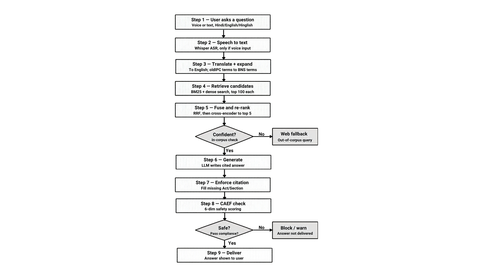
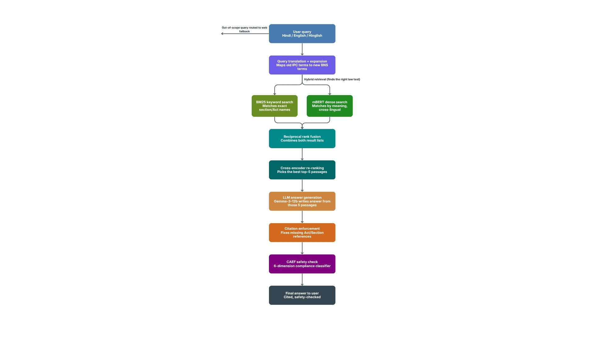
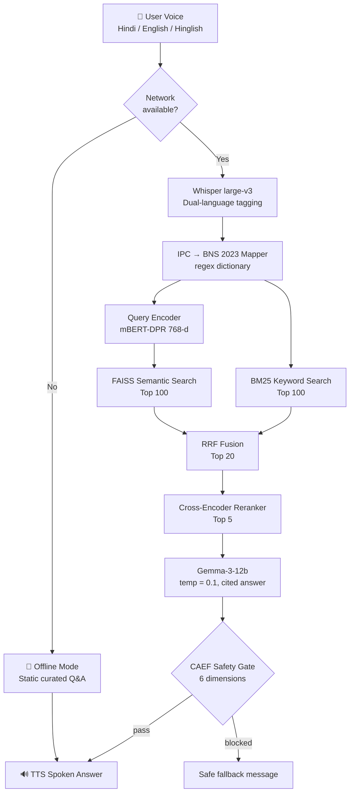
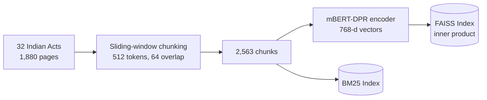
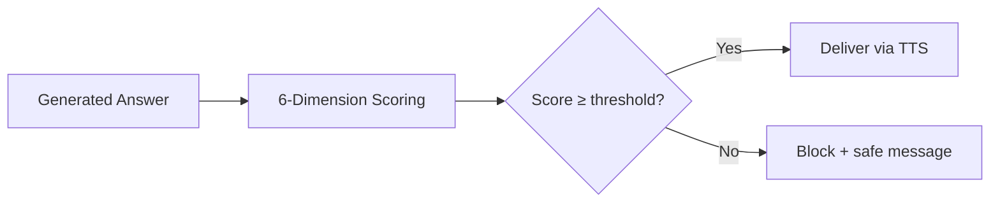
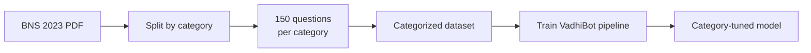

<div align="center">

# ⚖️ न्याय सहायक · Nyaya Sahayak
### Voice-First, Multilingual AI Legal Assistant for Visually Impaired Indian Citizens

*Speak your problem. Hear the law. Grounded in BNS 2023.*


</div>

---

## 📑 Table of Contents

1. [Overview](#-overview)
2. [Problem Statement](#-problem-statement)
3. [Objectives](#-objectives)
4. [Key Features](#-key-features)
5. [System Architecture](#-system-architecture)
6. [Detailed Pipeline](#-detailed-pipeline)
7. [IPC → BNS Mapping](#-ipc--bns-2023-mapping)
8. [Hybrid Retrieval](#-4-stage-hybrid-retrieval)
9. [Generation](#-answer-generation)
10. [CAEF Safety Framework](#-caef-compliance-aware-evaluation-framework)
11. [Online + Offline Modes](#-online--offline-modes)
12. [Category-Wise Training](#-category-wise-training-bns-2023)
13. [Datasets](#-datasets)
14. [Evaluation Methodology](#-evaluation-methodology)
15. [Results](#-results)
16. [Ablation Study](#-ablation-study)
17. [Tech Stack](#-tech-stack)
18. [Project Structure](#-project-structure)
19. [Getting Started](#-getting-started)
20. [Example Interaction](#-example-interaction)
21. [Limitations](#-honest-limitations)
22. [Future Work](#-future-work)
23. [Contributions](#-contributions)
24. [FAQ](#-faq)
25. [Glossary](#-glossary)
26. [Disclaimer](#-disclaimer)

---

## 🌟 Overview

**VadhiBot** is a voice-first, multilingual legal assistant built for **visually impaired Indian citizens** who cannot easily access legal help. A user simply *speaks* a legal question in **Hindi, English, or Hinglish**, and VadhiBot replies with a **cited, safety-checked answer spoken aloud**.

It is built on **Retrieval-Augmented Generation (RAG)** over **32 Indian Acts** and is fully updated for the **Bharatiya Nyaya Sanhita (BNS) 2023**, the law that replaced the 160-year-old Indian Penal Code in July 2024.

---

## 🎯 Problem Statement

| Challenge | Reality |
|-----------|---------|
| 👁️ Accessibility | **90M+** visually impaired citizens in India |
| 🗣️ Language | **900M+** Hindi speakers; people naturally mix Hindi + English (Hinglish) |
| ⚖️ Legal aid | Almost no **affordable**, voice-accessible legal aid |
| 📜 New law | IPC was replaced by **BNS 2023**; most AI tools still answer with old IPC sections |
| 🤥 AI risk | Plain LLMs **hallucinate**, which is dangerous in a legal setting |

---

## 🎯 Objectives

1. Let users ask legal questions **by voice** in Hindi / English / Hinglish.
2. Answer using **real law text**, not model memory (no hallucinated sections).
3. Support the **IPC → BNS 2023** transition automatically.
4. Enforce **safety and compliance** on every answer before delivery.
5. Keep working even with **no internet** (offline fallback).
6. Return answers as **speech**, accessible without a screen.

---

## ✨ Key Features

- 🎤 **Voice-first:** Whisper large-v3 with dual-language tagging for code-switched speech
- 🔁 **IPC → BNS auto-mapping:** old section references are expanded to the new law
- 🌐 **Cross-lingual retrieval:** Hindi query can retrieve English law text
- 🔍 **4-stage hybrid retrieval:** BM25 + DPR + RRF + Cross-encoder
- 📚 **Grounded generation:** answers cite **Act name + Section number**
- 🛡️ **CAEF safety gate:** rule-based, fully auditable, runs on every answer
- 🗂️ **Category-wise trained model** on BNS 2023 categories
- 📴 **Offline mode:** curated static knowledge base with automatic switching
- 🔊 **TTS output:** spoken answers for visually impaired users
- 🎓 **Practical examples + legal disclaimer** in every answer

---

## 🏗️ System Architecture

### Architecture Diagrams

<div align="center">


*Figure 1: Overall VadhiBot architecture*


*Figure 2: Retrieval and safety pipeline*

</div>

### End-to-End Flow



### Offline Indexing Flow



---

## 🔬 Detailed Pipeline

| # | Stage | Details |
|---|-------|---------|
| 1 | **ASR** | OpenAI **Whisper large-v3** (1.55B params). Dual-language tagging (Hindi + English tokens together) handles mid-sentence language switching |
| 2 | **Query Processing** | Regex-based **IPC→BNS dictionary** expands old references to new ones |
| 3 | **Tokenization** | **mBERT WordPiece** (`BertTokenizerFast`, Hugging Face) |
| 4 | **Chunking** | **32 Acts / 1,880 pages → 2,563 chunks**, 512 tokens each, 64-token overlap (sliding window) |
| 5 | **Embedding** | **mBERT-DPR** (`bert-base-multilingual-cased`) → **768-d** vectors for chunks and queries |
| 6 | **Vector DB** | **FAISS** (`faiss-cpu`), inner-product similarity, top 100 |
| 7 | **Hybrid retrieval** | BM25 → DPR → RRF → Cross-encoder → **top 5** |
| 8 | **Generation** | **Gemma-3-12b**, temperature 0.1, strict citation prompt |
| 9 | **Safety** | **CAEF** rule-based 6-dimension checker |
| 10 | **Output** | **TTS** spoken response |

### Why overlapping chunks?
The 64-token overlap makes sure a legal clause that falls on a chunk boundary is still fully visible in at least one chunk.

### Why cross-lingual embeddings?
mBERT maps Hindi and English into the **same vector space**, so a Hindi question can match an English statute passage without translating the query.

---

## 🔁 IPC → BNS 2023 Mapping

The regex dictionary detects old IPC references in the user's speech and **also searches the matching BNS section**, so answers stay current even when the user says the old section number.

| Old (IPC) | Topic | New (BNS 2023) |
|-----------|-------|----------------|
| Section 302 | Punishment for murder | Section 103 |
| Section 307 | Attempt to murder | Section 109 |
| Section 376 | Punishment for rape | Section 64 |
| Section 379 | Punishment for theft | Section 303 |
| Section 420 | Cheating | Section 318 |
| Section 498A | Cruelty by husband/relatives | Section 85 |

---

## 🔍 4-Stage Hybrid Retrieval

| Stage | Method | Role | Output |
|-------|--------|------|--------|
| 1 | **BM25** (`rank_bm25`) | Exact keywords, legal terms, section numbers | Top 100 |
| 2 | **mBERT-DPR + FAISS** | Semantic, cross-lingual meaning match | Top 100 |
| 3 | **RRF** (Reciprocal Rank Fusion) | Merges both lists **by rank position**, not raw score | Top 20 |
| 4 | **Cross-encoder** (`sentence-transformers`) | Reads query + passage **jointly** for fine-grained relevance | **Top 5** |

**Why hybrid?**
- BM25 is excellent at exact section numbers and legal terms but blind to meaning across languages.
- DPR understands meaning and language but is not trained on Indian legal text.
- RRF combines both without needing to normalize incompatible score scales.
- The cross-encoder is slower but far more accurate, so it is applied only to the top 20.

---

## 🧾 Answer Generation

- **Model:** Gemma-3-12b (Google, open-weight)
- **Temperature:** 0.1 (low creativity, high consistency)
- **Context:** only the **top 5 retrieved passages**
- **Prompt rules:**
  - Cite **Act name + Section number**
  - Give a **practical example**
  - Add a **legal disclaimer**
  - Do not answer beyond the retrieved text

---

## 🛡️ CAEF: Compliance-Aware Evaluation Framework

A **rule-based (non-AI)** checker on every answer. It is deterministic and fully auditable by design.

| Dimension | Weight | What it checks |
|-----------|--------|----------------|
| Factual Anchor | 20% | Claims are traceable to retrieved law |
| Compliance Safety | 20% | No dangerous or unlawful guidance |
| Citation Precision | 15% | Correct Act and Section citations |
| Relevance Ratio | 15% | Answer stays on the user's question |
| Language Appropriateness | 15% | Suitable language and tone |
| Disclaimer Adherence | 15% | Legal disclaimer present |

- Score range: **0–1**. Below threshold → **answer blocked**.
- **Mean CAEF score: 0.902**
- **100% accuracy on adversarial test cases**



---

## 📡 Online + Offline Modes

| | 🌐 Online Mode | 📴 Offline Mode |
|---|---|---|
| **Engine** | Full trained RAG pipeline (this document) | Static, curated question–answer knowledge base |
| **Trigger** | Network available | Network unavailable |
| **Strength** | Broad coverage, grounded generation, citations | Always available, instant, no dependency |
| **Trade-off** | Needs internet | Limited to curated questions |

The app **automatically switches** between the two, so a visually impaired user is never left without an answer.

---

## 🗂️ Category-Wise Training (BNS 2023)

To improve domain precision, the BNS 2023 was divided by category
(source: [NCRB BNS 2023 PDF](https://www.ncrb.gov.in/uploads/SankalanPortal/DownloadPDF/BNS2023.pdf)).

| Item | Value |
|------|-------|
| Number of categories | `[N_CATEGORIES: confirm 358 or 100]` |
| Questions per category | **150** (generated) |
| Total questions | `[N_CATEGORIES × 150]` |
| Model | Same VadhiBot pipeline, trained on the categorized data |



**Benefits:** better topic coverage, sharper retrieval per legal domain, and more reliable out-of-scope routing.

---

## 📦 Datasets

| Dataset | Description |
|---------|-------------|
| **Legal corpus** | 32 Indian Acts, 1,880 pages, 2,563 chunks |
| **Evaluation set** | 500 synthetic Q&A pairs |
| **Adversarial set** | Dangerous / out-of-scope prompts for CAEF testing |
| **Category dataset** | 150 generated questions per BNS category |
| **Offline KB** | Static curated Q&A list |

---

## 📐 Evaluation Methodology

| Metric | Meaning |
|--------|---------|
| **Recall@5** | Fraction of questions where the right passage appears in the top 5 |
| **NDCG@10** | Ranking quality, rewarding relevant passages placed higher |
| **MRR@10** | How early the first correct passage appears |
| **Faithfulness** | Fraction of answer sentences traceable to retrieved law |
| **Hallucination rate** | Fraction of answers containing unsupported claims |
| **CAEF accuracy** | Correct allow/block decisions on adversarial inputs |
| **Out-of-scope routing** | Correctly refusing or redirecting non-legal / unsupported queries |
| **Wilcoxon test / Cohen's d** | Statistical significance and effect size of improvement |

---

## 📊 Results

### Baseline (Measured)

| Metric | Score |
|--------|-------|
| Recall@5 | **0.893** |
| NDCG@10 | **0.773** |
| MRR@10 | **0.729** |
| Faithfulness | **0.930** |
| Hallucination rate | **7.4%** (from 50%, an **85% reduction**) |
| CAEF safety accuracy | **100%** (adversarial) |
| Mean CAEF score | **0.902** |
| Out-of-scope routing | **92%** |
| Wilcoxon *p* | **0.0003** |
| Cohen's *d* | **0.413** |

### RAG vs Zero-Shot

| System | Faithfulness | Hallucination |
|--------|--------------|---------------|
| Zero-shot LLM (no retrieval) | 0.000 | 50% |
| **VadhiBot (RAG)** | **0.930** | **7.4%** |

### Baseline vs Category-Tuned

| Metric | Baseline | Category-Tuned | Δ |
|--------|----------|----------------|---|
| Recall@5 | 0.893 | `TBD` | `TBD` |
| NDCG@10 | 0.773 | `TBD` | `TBD` |
| MRR@10 | 0.729 | `TBD` | `TBD` |
| Faithfulness | 0.930 | `TBD` | `TBD` |
| Hallucination rate | 7.4% | `TBD` | `TBD` |
| Out-of-scope routing | 92% | `TBD` | `TBD` |

---

## 🧪 Ablation Study

### Retrieval

| Configuration | Recall@5 |
|---------------|----------|
| BM25 only | 0.818 |
| mBERT-DPR + FAISS only | 0.500 |
| **BM25 + DPR + RRF + Cross-encoder** | **0.893** |

### Reranking

| Configuration | NDCG@10 |
|---------------|---------|
| Before cross-encoder | 0.677 |
| **After cross-encoder** | **0.773** |


---

## 🧰 Tech Stack

| Layer | Tool |
|-------|------|
| ASR | OpenAI Whisper large-v3 |
| Tokenization | mBERT WordPiece (`BertTokenizerFast`) |
| Embeddings | mBERT-DPR (`bert-base-multilingual-cased`) |
| Vector DB | FAISS (`faiss-cpu`) |
| Keyword search | `rank_bm25` |
| Reranker | Cross-encoder (`sentence-transformers`) |
| LLM | Gemma-3-12b |
| Safety | Custom CAEF (Python, regex + dictionary) |
| TTS | Text-to-speech engine `[specify]` |
| Backend | Python, PyTorch |

---

## 📁 Project Structure

```
VadhiBot/
├── images/                  # architecture diagrams
├── data/
│   ├── acts/                # 32 Indian Acts
│   ├── chunks/              # 2,563 chunks
│   ├── categories/          # BNS category-wise questions
│   └── offline_kb.json      # static curated Q&A
├── asr/                     # Whisper large-v3 + dual-language tagging
├── query/                   # IPC → BNS mapper
├── retrieval/
│   ├── bm25.py
│   ├── dpr_faiss.py
│   ├── rrf.py
│   └── reranker.py
├── generation/              # Gemma-3-12b prompting
├── caef/                    # rule-based safety checker
├── tts/
├── eval/                    # metrics and significance tests
├── app.py
└── README.md
```

*(Adjust to match your real repository.)*

---

## 🚀 Getting Started

```bash
# 1. Clone
git clone https://github.com/<your-username>/VadhiBot.git
cd VadhiBot

# 2. Install
pip install -r requirements.txt

# 3. Build indices
python build_index.py

# 4. Run
python app.py
```

**Requirements:** Python 3.10+, PyTorch, Hugging Face Transformers, `faiss-cpu`, `rank_bm25`, `sentence-transformers`, Whisper.

---

## 💬 Example Interaction

> 🎤 **User (Hinglish):** "Agar koi mera phone chura le to kaunsi dhara lagti hai?"
>
> 🔎 **Retrieved:** BNS 2023, theft provisions (top 5 passages)
>
> 🔊 **VadhiBot:** "Under the Bharatiya Nyaya Sanhita 2023, theft is punishable under Section 303. For example, if someone takes your phone without your consent with dishonest intent, this section can apply.

---

## ⚠️ Honest Limitations

- Evaluated on a **synthetic dataset (500 Q&A pairs)**, not real citizen queries
- CAEF knows only **8 dangerous phrase patterns**; novel phrasing could slip through
- mBERT is **not fine-tuned on Indian legal text**, so a cross-lingual gap remains
- **No WER** reported for the ASR component
- **No latency profiling** reported
- **Not yet tested with real visually impaired users**

---

## 🔭 Future Work

- [ ] User studies with visually impaired citizens
- [ ] Fine-tune embeddings on Indian legal text (e.g., InLegalBERT)
- [ ] Report ASR **WER** on Hinglish legal speech
- [ ] Latency profiling and on-device optimization
- [ ] Expand CAEF beyond pattern rules
- [ ] Evaluate on real citizen queries
- [ ] Add regional languages (Tamil, Bengali, Marathi, Telugu…)
- [ ] Mobile app with screen-reader integration

---

## 👩‍💻 Contributions

- Designed and experimentally evaluated the **4-stage hybrid retrieval pipeline**
- Reduced hallucination by **85%** with Gemma-3-12b; **0.930 faithfulness** across 32 Acts
- Developed **Hindi/Hinglish ASR** using Whisper large-v3 with dual-language tagging
- Contributed to the **CAEF** safety checker design
- Implemented the **IPC → BNS 2023** statutory mapping

---

## ❓ FAQ

**Why RAG instead of fine-tuning only?**
RAG grounds every answer in real law text and lets us cite sections. It also handles law updates without retraining.

**Why is CAEF rule-based and not another AI model?**
Rules are deterministic and auditable, which matters in a legal and safety setting.

**Why does BM25 beat DPR alone?**
mBERT-DPR isn't trained on Indian legal text, while BM25 matches exact legal terms and section numbers. DPR still adds cross-lingual recall, and fusion plus reranking gets the best result.

**Why RRF instead of score averaging?**
BM25 and DPR scores live on different scales. RRF uses rank positions, so no normalization is needed.

**What if there is no internet?**
The app switches to offline mode with a curated static knowledge base.

**Is this legal advice?**
No. It provides general legal information only.

---

## 📖 Glossary

| Term | Meaning |
|------|---------|
| **IPC** | Indian Penal Code (1860), replaced in July 2024 |
| **BNS 2023** | Bharatiya Nyaya Sanhita, the new criminal code |
| **RAG** | Retrieval-Augmented Generation |
| **ASR** | Automatic Speech Recognition |
| **TTS** | Text-to-Speech |
| **BM25** | Keyword-based ranking algorithm |
| **DPR** | Dense Passage Retrieval |
| **FAISS** | Facebook AI Similarity Search |
| **RRF** | Reciprocal Rank Fusion |
| **CAEF** | Compliance-Aware Evaluation Framework |
| **WER** | Word Error Rate |
| **Code-switching** | Mixing languages within a sentence (e.g., Hinglish) |

---

## ⚖️ Disclaimer

VadhiBot provides general legal **information**, not legal advice. Please consult a qualified advocate for your specific case.

---

<div align="center">

**Built with ❤️ to make the law accessible to everyone.**

</div>